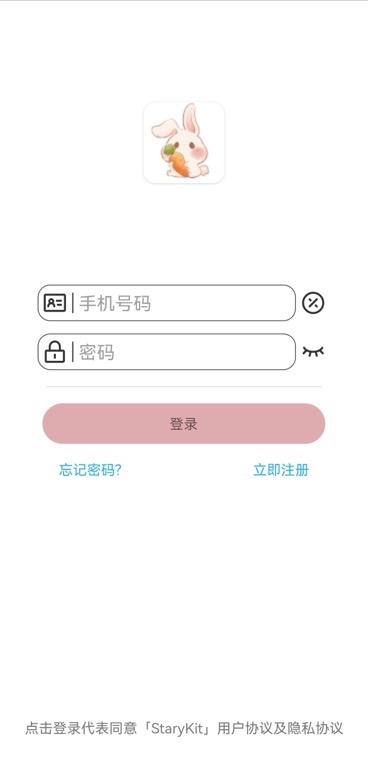

> 借你一个美梦💫

## 开发背景
家庭教育环节对学前及小学前期阶段儿童(0-10岁)的思维，逻辑能力的发展至关重要。

但很多家长并没有相关专业能力，也无法抽出大量时间用以获取相关的学习，故事资源，与孩子的交流存在沟壑。

故本产品旨在为儿童成长环节搭建一个兼具娱乐性🎮，学习性📖的平台，帮助其想象力发展，世界观构建，在优良资源下助力家长构建更好的家庭教育环节。

## 基本功能和玩法介绍

共有游戏区，学习区，故事区三大模块。

学习区划分难度等级供用户选择，也鼓励其挑战更具难度的知识：

游戏区由项目人员筛选兼具趣味与娱乐性的h5小游戏（包含轻难度的棋类游戏和连连看等简单策略游戏）：

故事区收集经典和新鲜的短篇故事，为家长提供整理完备的优质故事资源：

## 使用说明

### 1.从登录开始吧！
最先出现的是漂亮的启动页

<!--  -->

等待它结束后就进入登录界面啦～

<!--  -->

如果是第一次登录要选中立即注册先注册自己的账号哦

如果有注册账号就输入相应的手机号和密码即可

<!--  -->

输入自己的手机号和密码，密码长度限制要大于5位，并注意输入正确的手机号格式

注册或者登录成功后就自动跳转到首页快乐玩耍啦💖

### 2.首页

<!--  -->

#### 2.1 学习区

#### 2.2 游戏区

#### 2.3 故事区

### 3.我的

<!--  -->

#### 3.1 我的故事

#### 3.2 错题集

#### 3.3 我的游戏

## 获取

download release
https://github.com/AmiyaSX/StaryKitApp/releases/download/v1.0.1/app-release.apk